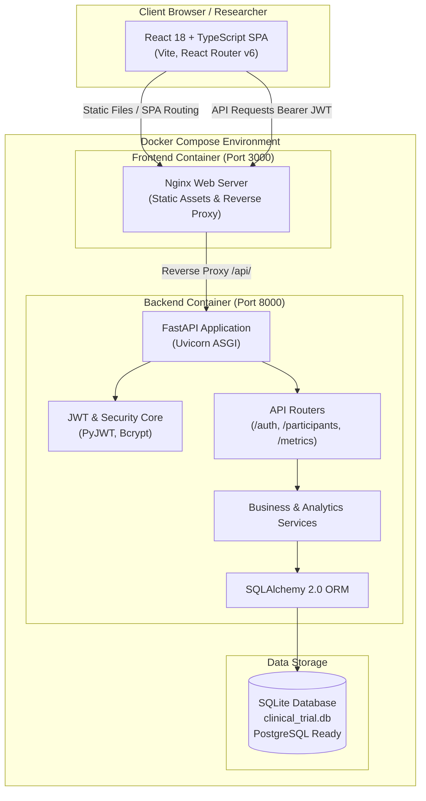

# Clinical Trial Data Dashboard & API Platform

A modern, production-grade full-stack platform for clinical research teams to manage trial participants, track study arm distribution (treatment vs. control), monitor participant statuses (active, completed, withdrawn), and analyze real-time cohort demographics.

---

## Architecture Overview

The system follows an **API-centric, layered architecture** ensuring strict separation between user presentation, business logic, domain models, and storage layers.



---

## Technologies & Rationale

| Layer | Technology | Version | Rationale |
|---|---|---|---|
| **Frontend Framework** | React + TypeScript | 18.3.1 / 5.7 | Component modularity, robust hook lifecycle, compile-time type safety matching backend schemas. |
| **Frontend Tooling** | Vite | 6.0.5 | Ultra-fast Hot Module Replacement (HMR) and optimized Rollup-based production builds. |
| **Routing** | React Router | 6.28.1 | Declarative client-side routing, protected navigation guards, authentication redirects. |
| **UI Styling & Icons** | Vanilla CSS + Lucide React | 0.469.0 | Clean, lightweight, professional dashboard design system without heavy framework dependencies. |
| **Backend API** | FastAPI | 0.115.6 | Fast ASGI framework with native async support, automatic OpenAPI/Swagger docs, and Pydantic validation. |
| **Data Validation** | Pydantic v2 | 2.10.4 | Strict runtime request/response serialization, schema validation, and defensive boundary checking. |
| **ORM / Database** | SQLAlchemy | 2.0.36 | Typed declarative models; SQLite for frictionless zero-config evaluation, PostgreSQL-ready. |
| **Security / Auth** | PyJWT + Bcrypt | 2.10.1 / 4.2.1 | Stateless JWT authentication, secure password hashing with salt and 72-byte truncation protection. |
| **Testing** | Pytest + Vitest | 8.3.4 / 2.1.8 | Fast parallel test execution, API integration coverage, and component DOM assertions. |
| **Containerization** | Docker + Docker Compose | Alpine-based | Multi-stage production container builds with Nginx reverse proxy routing. |

---

## Project Structure

```
.
├── CHALLENGE.md                  # Challenge specification
├── docker-compose.yml            # Container orchestration for frontend & backend
├── .env.example                  # Example environment variables
├── README.md                     # Comprehensive system documentation
├── docs/
│   └── DECISIONS.md              # Architecture Decision Records (ADRs)
├── backend/
│   ├── Dockerfile                # Python 3.12 slim container definition
│   ├── requirements.txt          # Python dependencies
│   ├── app/
│   │   ├── main.py               # FastAPI entrypoint, middleware, lifespan
│   │   ├── database.py           # SQLAlchemy engine & session factory
│   │   ├── seed.py               # Idempotent demo user & participant seeder
│   │   ├── core/
│   │   │   ├── config.py         # Pydantic BaseSettings environment config
│   │   │   ├── security.py       # Bcrypt password hashing & JWT token logic
│   │   │   ├── deps.py           # Dependency injection (Auth, DB session)
│   │   │   └── logging.py        # Centralized structured logging setup
│   │   ├── models/
│   │   │   ├── user.py           # User model (email, password_hash, full_name)
│   │   │   └── participant.py    # Participant model (UUID, status, group, age)
│   │   ├── schemas/
│   │   │   ├── auth.py           # LoginRequest, TokenResponse, UserRead
│   │   │   ├── participant.py    # ParticipantCreate, ParticipantRead, Enums
│   │   │   └── metrics.py        # MetricsResponse aggregate schema
│   │   ├── routers/
│   │   │   ├── auth.py           # /api/auth/login, /api/auth/me
│   │   │   ├── participants.py   # GET /api/participants, POST, GET /{id}
│   │   │   └── metrics.py        # GET /api/metrics (aggregated KPIs)
│   │   └── services/
│   │       ├── auth.py           # User authentication & retrieval logic
│   │       ├── participants.py   # Participant query & creation business logic
│   │       └── metrics.py        # SQL aggregation of trial metrics
│   └── tests/
│       ├── conftest.py           # Test fixtures & in-memory SQLite isolation
│       ├── test_auth.py          # Authentication endpoint tests
│       ├── test_participants.py  # Participant CRUD, validation & filter tests
│       ├── test_metrics.py       # Metrics aggregation calculation tests
│       └── test_health.py        # Health probe test
└── frontend/
    ├── Dockerfile                # Multi-stage build (Node 22 -> Nginx Alpine)
    ├── nginx.conf                # Nginx SPA fallback + /api/ reverse proxy
    ├── package.json              # NPM dependencies and scripts
    ├── tsconfig.json             # TypeScript compiler configuration
    ├── vite.config.ts            # Vite & Vitest configuration
    ├── index.html                # Single Page App HTML shell
    └── src/
        ├── App.tsx               # Root routing & protected component tree
        ├── main.tsx              # React DOM mounting
        ├── index.css             # Tailwind-compatible styling & design system
        ├── api/
        │   ├── client.ts         # Centralized Fetch wrapper & 401 interceptor
        │   ├── auth.ts           # Login & Current User API requests
        │   ├── participants.ts   # Participant list, retrieve, create requests
        │   └── metrics.ts        # Trial metrics API request
        ├── context/
        │   └── AuthContext.tsx   # React Context for JWT auth state management
        ├── types/
        │   └── index.ts          # Unified TypeScript interfaces and Enums
        ├── components/
        │   ├── Navbar.tsx        # Top navigation, user profile, logout
        │   ├── ProtectedRoute.tsx# Route guard checking authentication state
        │   ├── MetricCard.tsx    # KPI metric card component
        │   ├── StatusBadge.tsx   # Status, study group, gender badge
        │   ├── AddParticipantModal.tsx # Form modal to enroll new participant
        │   ├── ParticipantDetailModal.tsx # Modal showing full participant profile
        │   ├── LoadingSpinner.tsx# Reusable loading animation
        │   └── ErrorMessage.tsx  # Error boundary display with retry action
        ├── pages/
        │   ├── LoginPage.tsx     # Authentication form with demo auto-fill
        │   ├── DashboardPage.tsx # Overview KPIs, cohort distribution, recent list
        │   ├── ParticipantsPage.tsx # Filterable participant registry & search
        │   ├── ParticipantDetailPage.tsx # Dedicated view for participant
        │   └── NotFoundPage.tsx  # 404 fallback page
        └── test/
            └── setup.ts          # Vitest and Testing Library setup
```

---

## Quick Start with Docker (Recommended)

Make sure Docker Desktop is running.

```bash
docker compose up --build
```

- **Frontend Dashboard:** [http://localhost:3000](http://localhost:3000)
- **Backend API Docs (Swagger UI):** [http://localhost:8000/docs](http://localhost:8000/docs)
- **Backend Health Check:** [http://localhost:8000/api/health](http://localhost:8000/api/health)

To stop the containers:
```bash
docker compose down
```

---

## Manual Local Run Instructions

### 1. Backend Setup (Python 3.12+)

```bash
cd backend
python -m venv .venv

# On Windows (PowerShell):
.venv\Scripts\Activate.ps1
# On macOS/Linux:
# source .venv/bin/activate

pip install -r requirements.txt
uvicorn app.main:app --reload --port 8000
```
Backend API will be available at `http://localhost:8000`.

### 2. Frontend Setup (Node.js 18+)

```bash
cd frontend
npm install
npm run dev
```
Frontend development server will be available at `http://localhost:5173`.

---

## Demo Login Credentials

The application automatically seeds a default demo user and 24 clinical trial participants on first launch.

- **Email:** `researcher@trial.dev`
- **Password:** `Demo1234!`

*(The Login page includes a one-click "Auto-fill" button for immediate access during review).*

---

## API Endpoints & Specification

| Method | Endpoint | Access | Description |
|---|---|---|---|
| `GET` | `/api/health` | Public | System health check probe. |
| `POST` | `/api/auth/login` | Public | Authenticates credentials and returns a Bearer JWT. |
| `GET` | `/api/auth/me` | Protected | Returns the profile of the currently authenticated user. |
| `GET` | `/api/metrics` | Protected | Aggregates trial KPIs (cohort total, active, completed, withdrawn, arms, average age). |
| `GET` | `/api/participants` | Protected | Lists participants with optional `?status=` and `?study_group=` filters. |
| `GET` | `/api/participants/{id}` | Protected | Retrieves single participant by UUID `participant_id`. |
| `POST` | `/api/participants` | Protected | Enrolls a new participant with validation. |

### Example: Authenticating and Calling Protected Endpoints

```bash
# 1. Obtain JWT Access Token
curl -X POST http://localhost:8000/api/auth/login \
  -H "Content-Type: application/json" \
  -d '{"email": "researcher@trial.dev", "password": "Demo1234!"}'

# Response:
# {"access_token": "eyJhbGciOi...", "token_type": "bearer", "expires_in": 3600}

# 2. Call Protected Metrics Endpoint
curl -X GET http://localhost:8000/api/metrics \
  -H "Authorization: Bearer <YOUR_ACCESS_TOKEN>"

# 3. Create a New Participant
curl -X POST http://localhost:8000/api/participants \
  -H "Authorization: Bearer <YOUR_ACCESS_TOKEN>" \
  -H "Content-Type: application/json" \
  -d '{
    "subject_id": "P025",
    "study_group": "treatment",
    "enrollment_date": "2024-06-15",
    "status": "active",
    "age": 44,
    "gender": "F"
  }'
```

---

## Running the Automated Test Suites

### Backend Tests (Pytest)

The backend test suite verifies authentication, token validation, 401 rejection, participant CRUD, uniqueness validation, and metric aggregations using an in-memory SQLite database:

```bash
cd backend
python -m pytest -v
```
**Results:** `20 passed in 5.97s`

### Frontend Tests (Vitest + React Testing Library)

The frontend test suite validates authentication state restoration, protected route behavior, login failures, API error boundaries, participant filtering, and metric card rendering:

```bash
cd frontend
npm test
```
**Results:** `12 passed in 3.43s`

### TypeScript & Production Build Verification

```bash
cd frontend
npm run build
```
**Results:** `tsc && vite build` completed with zero type errors.

---

## Completed Requirements vs. Intentionally Limited Scope

### Completed Features
- Full JWT authentication flow with Bcrypt password hashing.
- Idempotent database seeder creating researcher user and 24 diverse clinical trial records.
- Participant entity with UUID `participant_id`, unique `subject_id`, `study_group` (`treatment`/`control`), `status` (`active`/`completed`/`withdrawn`), `enrollment_date`, `age`, and `gender` (`F`/`M`/`Other`).
- Real-time aggregated metrics API (`/api/metrics`) computing cohort counts and average age.
- Interactive React dashboard with live KPI cards, visual progress bars, and recent enrollments.
- Filterable & searchable participant registry with status and study arm dropdowns.
- Participant enrollment modal with client and server input validation.
- Detailed participant inspection modals and dedicated detail pages with UUID copy utility.
- Multi-stage Docker containerization with Nginx reverse proxy.
- Comprehensive test coverage across backend and frontend.

### Intentionally Limited / Skipped Features (4-Hour Scope)
- **Participant Deletion / Mutation**: In clinical trials, participant records are subject to strict regulatory retention (e.g. 21 CFR Part 11). Direct deletion without an immutable audit trail was intentionally excluded.
- **Alembic Database Migrations**: `Base.metadata.create_all()` is used for local zero-config evaluation. Production would utilize formal migration scripts.
- **Refresh Tokens / Token Blacklisting**: Standard 60-minute Bearer JWTs are used for simplicity.

---

## Security Considerations

1. **Password Security**: Passwords are hashed using `bcrypt` with automatic salt generation. Pydantic schemas enforce a 72-byte max limit to prevent bcrypt truncation bypass.
2. **Timing Attack Defense**: Failed logins return an identical generic error message (`Incorrect email or password`) whether the email was not found or the password was incorrect.
3. **Defense-in-Depth Validation**: All inputs are validated both on the React client (immediate feedback) and through strict Pydantic schemas on the backend (future date rejection, age bounds 0-120, string lengths).
4. **CORS & Reverse Proxying**: In Docker production mode, frontend requests go through the internal Nginx reverse proxy, avoiding cross-origin exposure. Local CORS settings are strictly bound to authorized origin URLs.
5. **No Secrets in Source**: Environment configuration uses Pydantic `BaseSettings` reading from `.env` or container environments, with warnings on default dev secrets.

---

## CI/CD, Observability & Production Readiness

### CI/CD Pipeline Outline
A recommended GitHub Actions workflow would include:
1. **Lint & Typecheck**: `ruff check .` for Python and `tsc --noEmit` for TypeScript.
2. **Test Execution**: `pytest --cov=app` and `vitest run --coverage`.
3. **Container Build & Scan**: `docker buildx` with `trivy` container vulnerability scanning.
4. **Staging Deployment**: Push images to AWS ECR / Azure ACR and deploy to ECS Fargate or Kubernetes.

### Observability & Monitoring
- **Structured Logging**: Python standard logging with formatted timestamps and log levels.
- **Health Checks**: `/api/health` probes integrated with Docker compose healthchecks.
- **OpenTelemetry & Prometheus**: In production, integrate OpenTelemetry middleware for distributed tracing across clinical services.

---

## AI Usage Disclosure

AI coding assistants (GitHub Copilot) were utilized during the development of this challenge for boilerplate scaffolding, test fixture generation, and TypeScript interface synchronization. All business logic, architectural designs, security constraints, and validation boundaries were guided and verified by the engineer.

---

## Future Improvements with More Time

1. **Alembic Schema Versioning**: Add database migration tracking for production rollouts.
2. **PostgreSQL with Read Replicas**: Switch connection string for high-throughput concurrent trials.
3. **Role-Based Access Control (RBAC)**: Enforce granular permissions between Clinical Research Coordinators (CRCs), Principal Investigators (PIs), and Regulatory Monitors.
4. **Data Export & Reporting**: Add CSV/PDF export capabilities compliant with CDISC SDTM standards.
5. **AI Cohort Screening**: Introduce AI agents for natural-language cohort querying and protocol eligibility screening.
